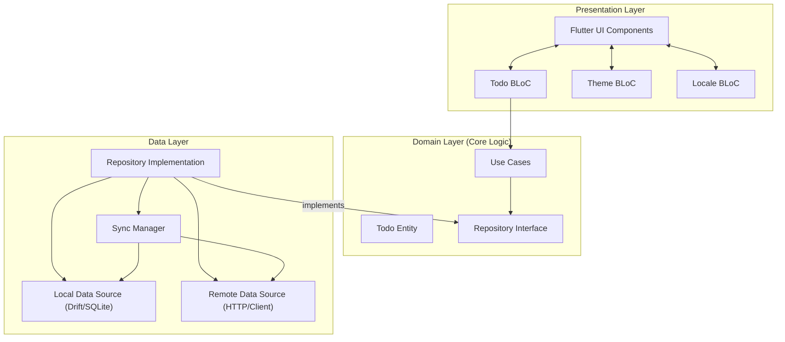
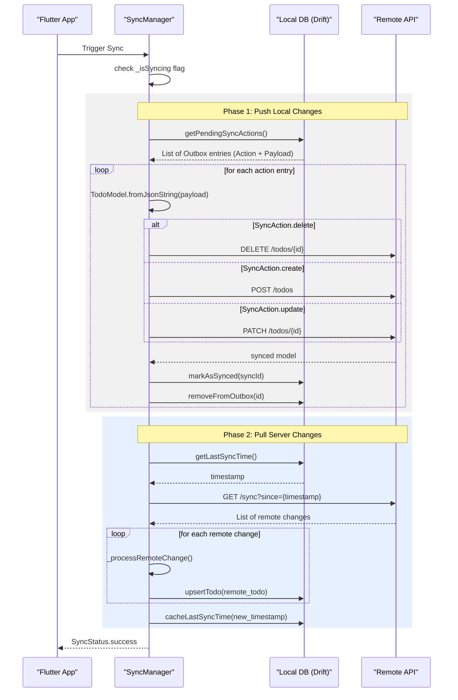

# Offline-First Todo App

A robust, production-ready Flutter Todo application showcasing an **Offline-First Architecture** with real-time synchronization.

## 🚀 Key Features
- **Transactional Outbox Pattern**: Robust synchronization using a dedicated queue with full JSON payloads and retry tracking.
- **Resilient Sync Engine**: Graceful handling of network conflicts (e.g., "Already Exists"/404) and automatic version incrementing for deterministic conflict resolution.
- **Offline-First**: Local storage is the primary source of truth. All user actions are instant and work without internet.
- **Smart Synchronization**: Bidirectional sync between local SQLite and remote API.
- **Conflict Resolution**: Version-based merging to ensure data integrity.
- **Dynamic Theming**: Dark/Light mode support with persistence.
- **Multi-Language Support**: English and Hindi with dynamic language switching and persistence.
- **Rich UI/UX**: Modern Material 3 cards, smooth animations, and optimized keyboard handling.
- **Debug Tools**: Built-in Drift DB Viewer to inspect local database state in real-time.

---

## 🏗️ Architecture

The project follows **Clean Architecture** principles, separated into three distinct layers:



### Layer Responsibilities:
- **Presentation**: BLoC for state management, mapping UI events to use cases, and rendering reactive states.
- **Domain**: Pure business logic (Entities and Use Cases). Independent of any framework or external library.
- **Data**: Implementation of repositories, managing data persistence (Drift/SQLite), and remote communication (HTTP).

---

## 🔄 Synchronization Flow

The `SyncManager` coordinates the complex dance between local and remote data. It follows a "Push-Before-Pull" strategy to ensure local changes are preserved.



---

## 🛠️ Technology Stack

| Technology | Purpose |
| :--- | :--- |
| **Flutter** | Cross-platform framework |
| **Drift (Moor)** | Reactive SQLite persistence |
| **Flutter BLoC** | State management (TodoBloc, ThemeBloc, LocaleBloc) |
| **GetIt** | Dependency Injection |
| **SharedPreferences** | Persisting theme and locale preferences |
| **i69n** | Type-safe internationalization with code generation |
| **Http** | Networking |
| **Connectivity Plus** | Real-time network monitoring |
| **Drift DB Viewer** | Debugging utility |

---

## 📦 Project Structure

```text
lib/
├── core/               # Shared logic, constants, and sync manager
│   ├── database/       # Drift database setup
│   ├── localization/   # i69n translations (en, hi)
│   ├── network/        # Network client and connectivity
│   ├── sync/           # Sync manager
│   ├── theme/          # App theme definitions
│   └── widgets/        # Shared widgets (BlocProvidersContainer)
├── features/
│   ├── todo/           # Todo Feature (Clean Arch)
│   │   ├── domain/     # Entities and Use Cases
│   │   ├── data/       # Models, Repositories, and Data Sources
│   │   └── presentation/ # BLoC and UI Components
│   ├── theme/          # Theme Feature
│   │   ├── domain/     # Theme repository interface
│   │   ├── data/       # Theme persistence with SharedPreferences
│   │   └── presentation/ # ThemeBloc
│   ├── locale/         # Locale/Language Feature
│   │   ├── domain/     # Locale repository interface
│   │   ├── data/       # Locale persistence with SharedPreferences
│   │   └── presentation/ # LocaleBloc
│   └── settings/       # Settings Feature
│       └── presentation/ # Settings UI (Theme & Language selectors)
└── injection_container.dart # Dependency Injection setup
```

---

## 🌐 Localization

The app supports **dynamic language switching** with full persistence:

### Supported Languages:
- 🇬🇧 **English** (en)
- 🇮🇳 **Hindi** (hi) - हिन्दी
- 🇮🇳 **Gujarati** (gu) - ગુજરાતી

### Features:
- **Dynamic Switching**: Change language in Settings → Language dropdown
- **Persistence**: Language preference persists across app restarts
- **Real-time Updates**: App immediately updates all text when language changes
- **Type-safe**: Uses i69n for generated type-safe translation classes

### Adding a New Language:
1. Create `lib/core/localization/translation/translations_<locale>.i69n.yaml`
2. Copy structure from `translations.i69n.yaml` and translate values
3. Register locale in `lib/core/localization/app_localization.dart`
4. Add to Settings page dropdown
5. Run: `flutter pub run build_runner build --delete-conflicting-outputs`

---

## 🛠️ Getting Started

1. **Pre-requisites**: Ensure you have Flutter installed.
2. **Local API**: The app expects a backend running at the URL defined in `lib/core/constants/constants.dart`.
3. **Environment**:
   ```bash
   flutter pub get
   flutter pub run build_runner build --delete-conflicting-outputs
   flutter run
   ```
