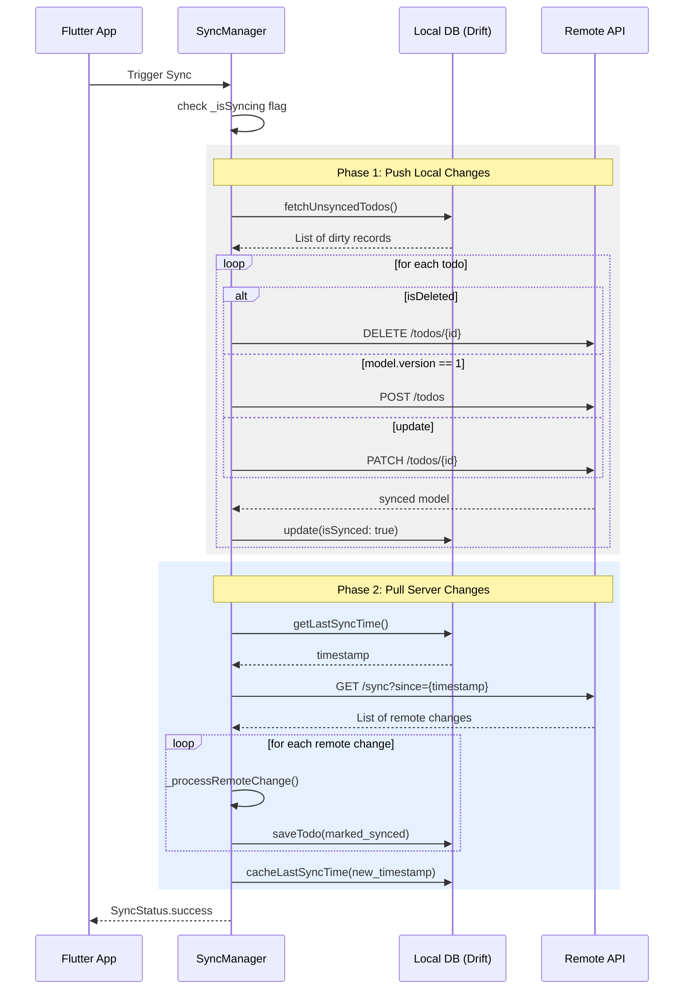

# Offline-First Todo App

A robust, production-ready Flutter Todo application showcasing an **Offline-First Architecture** with real-time synchronization.

## 🚀 Key Features
- **Offline-First**: Local storage is the primary source of truth. All user actions are instant and work without internet.
- **Smart Synchronization**: Bidirectional sync between local SQLite and remote API.
- **Conflict Resolution**: Version-based merging to ensure data integrity.
- **Rich UI/UX**: Modern Material 3 cards, smooth animations, and optimized keyboard handling.
- **Debug Tools**: Built-in Drift DB Viewer to inspect local database state in real-time.

---

## 🏗️ Architecture

The project follows **Clean Architecture** principles, separated into three distinct layers:

```mermaid
graph TD
    subgraph "Presentation Layer"
        UI[Flutter UI Components]
        Bloc[Todo BLoC]
    end

    subgraph "Domain Layer (Core Logic)"
        Entity[Todo Entity]
        UC[Use Cases]
        RepoInt[Repository Interface]
    end

    subgraph "Data Layer"
        RepoImpl[Repository Implementation]
        LDS[Local Data Source (Drift/SQLite)]
        RDS[Remote Data Source (HTTP/Client)]
        SyncMgr[Sync Manager]
    end

    UI <--> Bloc
    Bloc --> UC
    UC --> RepoInt
    RepoImpl -- implements --> RepoInt
    RepoImpl --> LDS
    RepoImpl --> RDS
    RepoImpl --> SyncMgr
    SyncMgr --> LDS
    SyncMgr --> RDS
```

### Layer Responsibilities:
- **Presentation**: BLoC for state management, mapping UI events to use cases, and rendering reactive states.
- **Domain**: Pure business logic (Entities and Use Cases). Independent of any framework or external library.
- **Data**: Implementation of repositories, managing data persistence (Drift/SQLite), and remote communication (HTTP).

---

## 🔄 Synchronization Flow

The `SyncManager` coordinates the complex dance between local and remote data. It follows a "Push-Before-Pull" strategy to ensure local changes are preserved.



---

## 🛠️ Technology Stack

| Technology | Purpose |
| :--- | :--- |
| **Flutter** | Cross-platform framework |
| **Drift (Moor)** | Reactive SQLite persistence |
| **Flutter BLoC** | State management |
| **GetIt** | Dependency Injection |
| **Http** | Networking |
| **Connectivity Plus** | Real-time network monitoring |
| **Drift DB Viewer** | Debugging utility |

---

## 📦 Project Structure

```text
lib/
├── core/               # Shared logic, constants, and sync manager
├── features/
│   └── todo/
│       ├── domain/     # Entities and Use Cases
│       ├── data/       # Models, Repositories, and Data Sources
│       └── presentation/ # BLoC and UI Components
└── injection_container.dart # Dependency Injection setup
```

---

## 🛠️ Getting Started

1. **Pre-requisites**: Ensure you have Flutter installed.
2. **Local API**: The app expects a backend running at the URL defined in `lib/core/constants/constants.dart`.
3. **Environment**:
   ```bash
   flutter pub get
   flutter pub run build_runner build --delete-conflicting-outputs
   flutter run
   ```
